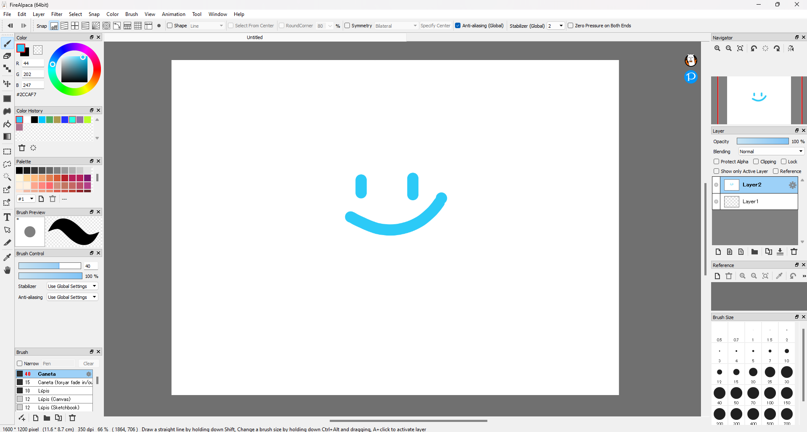
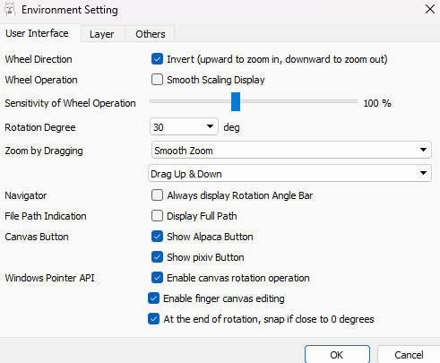
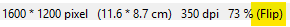
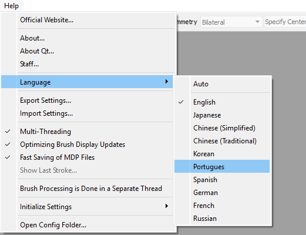
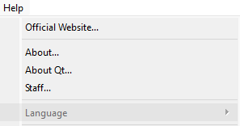
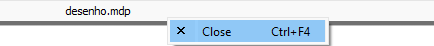
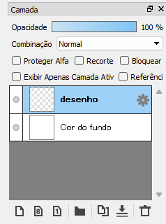
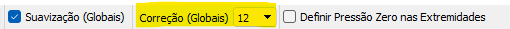
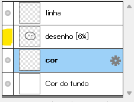
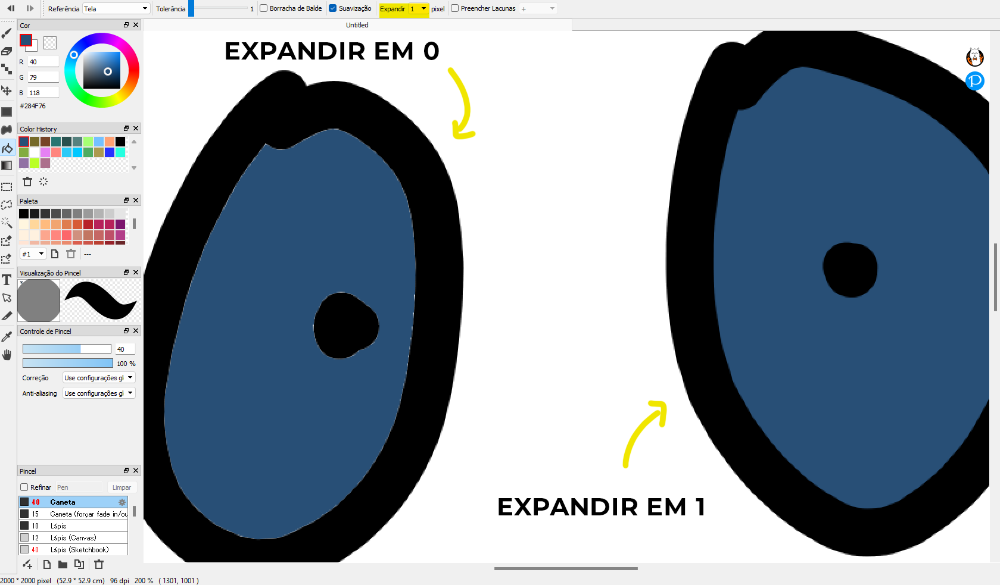

+++
title = "Como desenhar no FireAlpaca"
date = '2025-09-17T14:22:07-03:00'
draft = true
description = "Veja como começar do zero a usar o FireAlpaca, um programa gratuito e perfeito para começar a desenhar no digital."
categories = ["softwares"]
featuredImage = "content/blog/2025-09-19-como-desenhar-no-firealpaca/cover.png"
download = "/downloads/material.zip"   # link para baixar material
donation = "https://livepix.gg/desenhandocommack"  # link de doação
+++

## Introdução

O FireAlpaca é um dos programas mais interessantes para quem quer começar a desenhar no digital. É um programa leve, gratuito e simples de aprender, e isso é perfeito pra você que está começando agora a desenhar no computador.

Nesse tutorial eu não vou te ensinar a desenhar — você pode acessar a minha [playlist de tutorial de desenho](https://www.youtube.com/playlist?list=PL1K-UhVJGhmFoVF2rsvdXd7wBcm6FTZWT) para aprender a fazer isso, o que eu vou te mostrar é como usar o Firealpaca de forma que facilite você a colocar no mundo as ideias que você tem para criar.

- [Introdução](#introdução)
- [Conhecendo a interface](#conhecendo-a-interface)
- [Como navegar pela interface](#como-navegar-pela-interface)
- [Como alterar o idioma para português](#como-alterar-o-idioma-do-firealpaca)
- [Começando a desenhar](#começando-a-desenhar)
- [Linha do desenho](#linha-do-desenho)
- [Colorindo o desenho no FireAlpaca](#colorindo-o-desenho-no-firealpaca)

## Conhecendo a interface

Antes de aprender qualquer programa novo, a interface é a primeira coisa que vamos precisar olhar. É aqui onde você vai encontrar painéis, ferramentas e todos os recursos que o software tem pra te oferecer, e a **interface do FireAlpaca** é super simples.

### 1. Menu

Na parte superior do programa temos o **menu** de ações — comum em praticamente qualquer programa, é esse menu que te dá acesso às principais funções que ele tem.

Sempre que precisar encontrar algum recurso ou funcionalidade, olhe o menu de ações.

### 2. Opções das ferramentas

Logo abaixo ficam as **opções das ferramentas**, uma barra horizontal que te traz opções adicionais para cada ferramenta que estiver selecionada no momento. Aqui é o lugar onde você vai conseguir ajustar cada ferramenta do programa.

### 3. Barra de ferramentas

Logo em seguida, temos a **barra de ferramentas** — uma barra vertical localizada na lateral esquerda da interface. Ela funciona em conjunto com as opções da ferramentas que acabamos de conhecer. Nesse espaço estão reunidos o pincel, a borracha, as ferramentas de seleção e todas as outras ferramentas do FireAlpaca.

### 4. Tela de Desenho

Na área central temos a **tela de desenho**, que é a área que você tem para criar seus desenhos e ilustrações — vou te ensinar a navegar por ela daqui a pouco.

### 5. Painéis

O restante está preenchido com painéis diversos. Uns servem para exibir informações e outros trazem controles importantes pra ajustar e gerenciar o nosso trabalho.

## Como navegar pela interface

Agora você precisa aprender a navegar pelo programa, vou te mostrar como ampliar a tela, se mover e rotacionar a sua tela de desenho — isso vai ser muito importante pra agilizar o seu trabalho e te ajudar a trabalhar com mais precisão.

### 1. Movimentação da tela

A maneira mais rápida de movimentar a tela de desenho é segurar a barra de espaço do teclado enquanto clica e arrasta com o clique esquerdo. Você pode fazer a mesma coisa usando a ferramenta [**Hand Tool**](# "Ferramenta Mão").

### 2. Ampliar ou Reduzir

Pra aproximar ou afastar a visualização do desenho, usamos a roda do mouse. Por padrão, se você girar a roda do mouse pra frente ele afasta, se girar pra trás ele aproxima.

Pra gente o contrário é mais intuitivo: girar a roda do mouse para frente para proximar a tela de visualização, e girar a roda do mouse para trás para afastar a tela de visualização.

Se preferir, voce pode alterar esse comportamento indo até o menu [**File**](# "Arquivo") → [**Environment Setting**](# "Configuração de Ambiente") → e selecionar a opção [**Invert** (upward to zoom in, downward to zoom out)](# "Inverter").

### 3. Rotação da tela

Podemos ajustar facilmente a rotação da tela usando as teclas direcionais do teclado, para a esquerda e para a direita.

### 4. Inverter tela

Quando precisar inverter temporariamente a tela de desenho inteira use a tecla direcional do teclado para baixo. Você vai notar na barra inferior do programa que ele vai indicar com [(Flip)](# "(Inverter)") quando a tela estiver com esse modo ativado.

## Como alterar o idioma do FireAlpaca

Também é importante trocar o idioma do programa para o que é mais confortável pra você, isso facilita o nosso aprendizado no início, principalmente quando estamos aprendendo um novo [software](# "programa") de desenho.

Para deixar o FireAlpaca em português vá até o menu [**Help**](# "Help") → [**Language**](# "Language") → e **selecione o idioma** escolhido. Se ele não fizer isso sozinho, você precisa fechar e abrir o FireAlpaca para que as atualizações sejam feitas.

Caso a opção [**Language**](# "Language") esteja desabilitada como na imagem abaixo, você precisa fechar qualquer documento que esteja aberto — atualmente, o FireAlpaca não permite fazer a troca do idioma enquanto um arquivo está aberto.

Para fechar um arquivo, clique com o botão direito na barra do arquivo que fica na parte superior do programa e clique em **Close**.

## Começando a desenhar

### Passo 1: Criar o arquivo

Primeiro vamos criar um novo arquivo vindo no menu **Arquivo** → **Novo**.

Em **Largura** e **Altura** escolhemos o tamanho desse arquivo — recomendo trabalhar com no mínimo _2000 pixels_ pro arquivo não ficar pequeno demais, mas isso varia dependendo da sua necessidade.

Se você está pensando em desenhos feitos apenas para postar nas redes sociais e na web de maneira geral, _96 de resolução_ é o suficiente.

### Passo 2: Organizando as camadas

Através do painel **Camada** conseguimos organizar e editar o nosso desenho, por isso é importante que ele esteja sempre aberto e encaixado em algum lugar da interface.

Sempre que quiser abrir um painel na interface do FireAlpaca, vá até o menu <strong>Janela</strong> e selecione o painel desejado. Para fechar painéis, clique no X ao lado de cada painel.

Por padrão o FireAlpaca traz uma camada inicial nomeada _Camada 1_. Com um duplo clique em cima dessa camada conseguimos alterar o nome dela para algo que faça mais sentido pra gente, vou dar a essa camada o nome de _Cor do fundo_.

Eu prefiro que o fundo da minha tela de desenho seja branco, e não quadriculado — esse quadriculado está representando que a área do desenho está transparente. Por isso vou selecionar a **Ferramenta Balde** → selecionar a cor branco no painel **Cor** → e clicar em qualquer lugar da minha tela de desenho para preencher com a cor escolhida.

Agora, temos a camada **Cor do fundo** preenchida com branco.

Uma boa prática é sempre bloquear as camadas que você não quer correr o risco de modificar sem querer, por isso vou clicar em **Bloquear** para travar a camada **Cor do fundo**. Ela vai servir apenas como um fundo temporário pra eu conseguir visualizar melhor o meu desenho enquanto eu tiver desenhando.

### Passo 3: Criando uma nova camada

Precisamos também de uma nova camada para fazer o nosso desenho, basta clicar no botão de **Adicionar Camada** desse mesmo painel. O que ele vai fazer é criar uma camada transparente do jeito que a gente precisa, você vai perceber isso pela miniatura da camada exibindo o padrão quadriculado como eu te falei.

Então você pode trocar o nome da camada pra organizar desde o início o que é cada camada que você está criando — isso facilita encontrar mais rápido aquilo que você está procurando.

### Passo 4: Comece a desenhar

Agora que temos a nossa camada de fundo branca como um papel e uma camada transparente para o nosso desenho, podemos começar a desenhar!

Apenas escolha uma cor qualquer no painel **Cor** → selecione a **Ferramenta Pincel** e em seguida escolha um dos pincéis no **painel Pincel**. Recomendo clicar e testar cada um deles antes de começar a desenhar.

No painel **Visualização do Pincel** é possível alterar o tamanho do pincel.

A partir daqui é começar a fazer o seu desenho, nesse processo a **Ferramenta Borracha** vai ser muito importante também.

Para facilitar a trocar entre pincel e borracha, use atalhos de teclado — atalhos ajudam a tornar o processo mais rápido e fluido.

<table style="border-collapse: collapse; width: 50%;">
  <tr style="background:#f6f4f1;">
    <th style="border:1px solid #ccc; padding:8px;">Ferramenta</th>
    <th style="border:1px solid #ccc; padding:8px;">Tecla de Atalho</th>
  </tr>
  <tr>
    <td style="border:1px solid #ccc; padding:8px;">Ferramenta Pincel</td>
    <td style="border:1px solid #ccc; padding:8px;">B</td>
  </tr>
  <tr>
    <td style="border:1px solid #ccc; padding:8px;">Ferramenta Borracha</td>
    <td style="border:1px solid #ccc; padding:8px;">E</td>
  </tr>
  <tr>
    <td style="border:1px solid #ccc; padding:8px;">Tamanho do Pincel Anterior</td>
    <td style="border:1px solid #ccc; padding:8px;">[</td>
  </tr>
   <tr>
    <td style="border:1px solid #ccc; padding:8px;">Próximo Tamanho do Pincel</td>
    <td style="border:1px solid #ccc; padding:8px;">]</td>
  </tr>
  <tr>
    <td style="border:1px solid #ccc; padding:8px;">Desfazer ação</td>
    <td style="border:1px solid #ccc; padding:8px;">Ctrl + Z</td>
  </tr>
</table>

 

## Linha do desenho

Depois de esboçar você pode querer fazer uma lineart pro desenho que você criou, e pra fazer a linha separada do esboço nós criamos uma nova camada — já te ensinei a fazer isso no [Passo 3: Criando uma nova camada](#passo-3-criando-uma-nova-camada).

Essa é a ideia das camadas, ter a possibilidade de separar cada parte do nosso desenho em camadas diferentes. Dessa forma você não precisa ter medo de errar o desenho, basta organizar suas camadas.

Agora selecione a camada onde você fez o esboço ou a versão inicial do seu desenho — no meu caso camada "desenho", e diminua a opacidade arrastando o slide de **Opacidade** localizado na parte superior do painel Camada.

O desenho precisa ficar claro o suficiente para não te atrapalhar a fazer a linha depois.

Trave a camada do **desenho** clicando em **Bloquear** para não acabar desenhando nela sem querer → depois selecione a camada da **linha** para começar a fazer a lineart. Assim, cada parte do desenho fica na sua própria camada sem interferir na outra.

### Estabilizador de traço

Pra fazer linhas precisas, perfeitas e que não tremem é só ativar o estabilizador de traço. No FireAlpaca você vai encontrar essa opção na parte superior da interface depois que a Ferramenta Pincel estiver selecionada. Basta escolher um valor entre 0 e 100 em **Correção (Globais).**

Quanto maior o valor, mais suavizado o traço vai sair, porém mais lento também. Escolha o suficiente para você conseguir trabalhar direito.

## Colorindo o desenho no FireAlpaca

Para colorir o desenho podemos esconder a camada do esboço clicando na bolinha que fica no início de cada camada. Agora nós não queremos mais visualizar o esboço, apenas a linha.

Então, criamos uma nova camada para a cor, o detalhe é que essa camada **Cor** vai ficar abaixo da camada da linha. Se fosse o contrário, a cor iria cobrir a linha do seu desenho — a posição de cada camada na pilha de camadas importa.

Para alterar a posição de uma camada na pilha de camadas, clique com o clique esquerdo do mouse e arraste a camada para a posição desejada.

Para essa etapa de colorir pode ser útil usar a **Ferramenta Pincel** para áreas pequenas e a **Ferramenta Balde** para áreas grandes. Quando selecionar o Balde verifique nas Opções da Ferramenta a opção **Expandir**. Aumente o valor para 1 ou mais — isso vai depender da espessura da sua linha, e agora você consegue preencher o desenho sem deixar espaços em branco.

E pra quando você precisar fazer efeitos apenas dentro de áreas que você já coloriu, ative a opção **Proteger Alfa**. Quando essa opção está ativada em uma camada você só vai conseguir desenhar ou colorir dentro das regiões que não são transparentes dessa camada.

