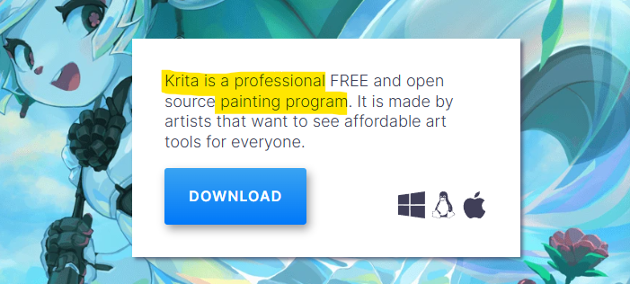
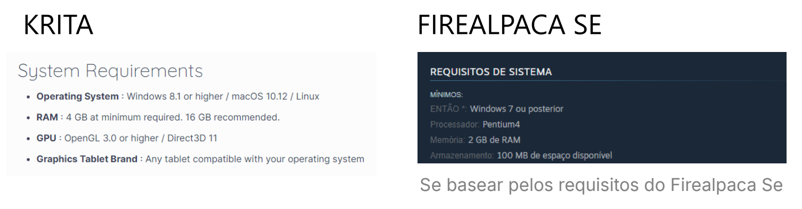

+++
title = "Krita ou FireAlpaca? Quem é melhor para iniciantes?"
date = '2025-09-20T14:22:07-03:00'
description = "Entre o Krita e o FireAlpaca, qual deles é a melhor opção para quem está começando a desenhar no digital?"
categories = ["softwares"]
featuredImage = "cover.png"
donation = "https://livepix.gg/desenhandocommack"  # link de doação
+++

## Introdução

O **Krita** e o **FireAlpaca** são dois dos programas de desenho digital que eu mais gosto de recomendar pra quem tá em dúvida de qual [software](# "programa") começar a usar.
Uma porque o Krita é o meu software de desenho favorito — naturalmente eu vou falar sobre aquilo que eu uso e gosto, mas também porque eles trazem tudo o que um desenhista digital precisa.

Então eu fiz um comparativo entre os dois, trazendo alguns pontos importantes que possam te ajudar a escolher um deles pra começar na sua jornada de desenho digital.

- [Introdução](#introdução)
- [Visão Geral](#visão-geral)
- [Interface](#1-interface)
- [Facilidade de uso](#2-facilidade-de-uso)
- [Conjunto de recursos](#3-conjunto-de-recursos)
- [Desempenho e Suporte](#4-desempenho-e-suporte)

## Visão Geral

Pra começar eu vou te trazer uma visão geral de cada um dos programas, a começar pelo Krita que é um **programa profissional de desenho digital gratuito** voltado para diferentes tipos de artistas.

No <a href="https://krita.org/en/" target="_blank">Krita</a> é possível produzir ilustração, concept art, história em quadrinhos e até animação 2D quadro a quadro. De fato, ele é um programa bem completo tanto para iniciantes como para usuários mais avançados.

Já o <a href="https://firealpaca.com/" target="_blank">FireAlpaca</a> é um programa de desenho digital mais simples — mas isso não faz dele uma opção ruim, inclusive há vantagens nisso e eu vou falar sobre elas mais pra frente. O importante é que você saiba que o FireAlpaca consegue te trazer todos os recursos básicos necessários e também te permite, em alguns pontos de forma mais limitada, fazer pinturas digitais, quadrinhos e também animação.

Resumindo, os dois são gratuitos e vão oferecer os recursos necessários pra você que tá começando agora a desenhar no digital, mas cada um tem vantagens e desvantagens que precisam ser comparadas as suas necessidades atuais.

Vamos falar sobre algumas delas!

## 1. Interface

Falando de interface o Krita é mais agradável — claro, estou comparado a versão [standard](# "padrão") do Firealpaca.

No Krita temos uma interface mais moderna, com diferentes opções de temas claros e escuros, além de um poder de personalização muito maior que no Firealpaca.

Exemplo: no Krita conseguimos personalizar o tamanho dos ícones da barra de ferramentas.

Por outro lado, a interface do Firealpaca me lembra o visual de sistemas operacionais mais antigos. Numa primeira impressão fica parecendo que é um programa ultrapassado que não tem tanto a oferecer — felizmente, isso não é verdade.

## 2. Facilidade de Uso

Em termos de facilidade de uso, quando estamos falando do Krita, nós vamos ter um programa um pouco mais complexo de aprender do que o FireAlpaca. Justamente pela quantidade de recursos e funcionalidades a mais que ele vai ter.

Por um lado isso é positivo, porque a longo prazo você sabe que o Krita vai te oferecer "tudo" o que você precisa para criar. Mas, do ponto de vista de um completo iniciante pode ser um pouco desafiador e muitas vezes até frustrante no início. Por isso é importante existirem programas como o FireAlpaca que vai atingir um outro público.

Especialmente, para quem nunca teve contato com outro programa de desenho digital antes, o FireAlpaca parece mais adequado — mesmo que no futuro você precise trocar de programa. Além de simples, o FireAlpaca é rápido de aprender, e para jovens ou usuários inexperientes em ferramentas digitais isso é essencial.

Se você gosta do Krita não se preocupa com o nível de dificuldade, você pode resolver isso consumindo <a href="https://www.youtube.com/playlist?list=PL1K-UhVJGhmGw4KoLNdvqe2b70h8UEUU5" target="_blank">tutoriais em vídeo</a>, através das <a href="https://krita-artists.org/" target="_blank">comunidades</a> que falam sobre o Krita ou em <a href="https://go.hotmart.com/I98301009X?dp=1" target="_blank">cursos</a> introdutórios. Tem muito conteúdo pago e gratuito para aprender sobre ele. 🚀

## 3. Conjunto de recursos

Eu vou chamar de **conjunto de recursos** as funcionalidades, recursos e ferramentas de cada programa — e no Krita, como você já deve imaginar, vamos ter um conjunto de recursos mais completo. Não à toa no próprio site oficial, eles definem o Krita como um programa de pintura profissional, então é de se esperar que ele seja mais completo mesmo.

No Krita você vai ter acesso a:

- uma biblioteca variada de pincéis para todos os tipos de trabalho, desde pincéis mais voltados pra esboço até pincéis para aquarela, já vem tudo pronto pra uso;
- criação e edição de diferentes tipos de camadas, inclusive camada do tipo vetorial, que é aquela que te permite redimensionar algo pro tamanho que você quiser sem ter perda de qualidade;
- timeline de animação bem completa, se você considerar que o foco do Krita não é animação;
- além disso, o Krita também permite instalar [plugins](# "complementos ou extensões") que adicionam novas funções ao programa — permitir expandir funcionalidades é uma das coisas que tornam o Krita ainda mais poderoso.

No FireAlpaca nós temos de vantagem:

- interface leve e fácil para iniciantes;
- a ferramenta de correção de traço funciona muito bem e não tem dificuldade pra configurar, perfeito pra quem precisa fazer muito trabalho com lineart;
- réguas simples de ativar e muito úteis pra quem está fazendo quadrinhos;
- e o jeito como funcionam as máscaras de camada é bem parecido com o Photoshop, que eu considero bem simples de usar.

## 4. Desempenho e Suporte

Quanto ao desempenho o melhor é baixar cada um dos dois e testar na prática, mas antes veja se o seu computador tem pelo menos os requisitos mínimos de sistema recomendados. No site oficial do Krita você vai encontrar essa informação na página de <a href="https://krita.org/en/download/" target="_blank">download</a>.

De maneira geral, se o seu computador é mais básico, escolha o FireAlpaca.

Falando de suporte, o Krita vai melhor. É um programa que está sempre trazendo <a href="https://krita.org/en/posts/" target="_blank">novas atualizações</a> e melhorias importantes.

Na versão padrão do FireAlpaca — que é a gratuita, tivemos pequenas <a href="https://firealpaca.net/news/" target="_blank">atualizações</a>, mas a maioria é sobre correção de bugs.

## 5. Recursos de Aprendizado

E por último, e essencial pra você que tá começando agora, os recursos de aprendizado — que são as formas onde você pode buscar ajuda pra aprender sobre o programa que você escolheu usar.

Pro Krita, a quantidade de informação sobre o programa é bastante ampla e variável. Você vai encontrar tutoriais em vídeo sobre o Krita, tem fórum de ajuda pra dúvidas mais específicas, cursos e eles também tem sua própria documentação oficial.

Já pro Firealpaca, além do próprio site e um tutorial ou outro sobre ele, não encontrei tanta coisa assim. Mas acaba sendo o suficiente porque ele não tem tantos recursos assim.

## Conclusão

No geral, o Krita mesmo com alguns pontos fracos quando estamos pensando em completos iniciantes no desenho digital, é uma melhor escolha do que o Firealpaca. Porque esses obstáculos iniciais de aprendizado podem ser facilmente resolvidos com tutoriais, cursos e fórum de ajuda.

Por outro lado, pra quem tem o problema de ter um PC mais simples e que não rode o Krita com tranquilidade, o FireAlpaca vai ser o programa perfeito.
