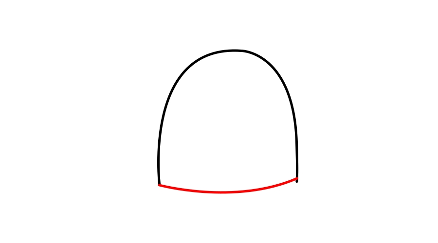
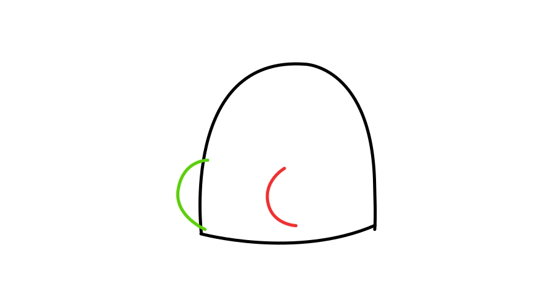
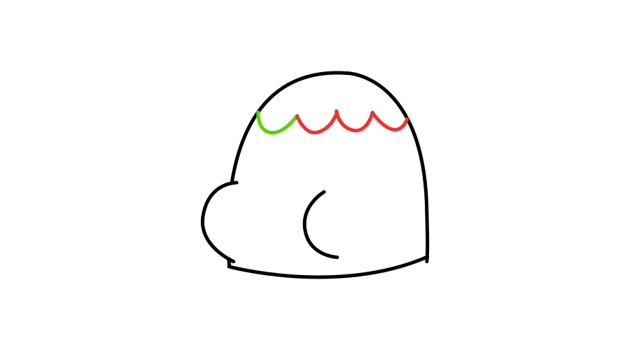
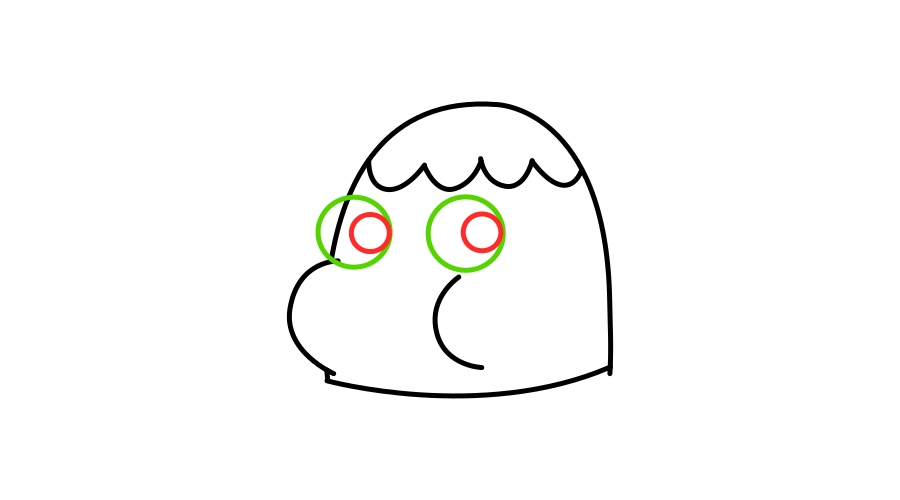
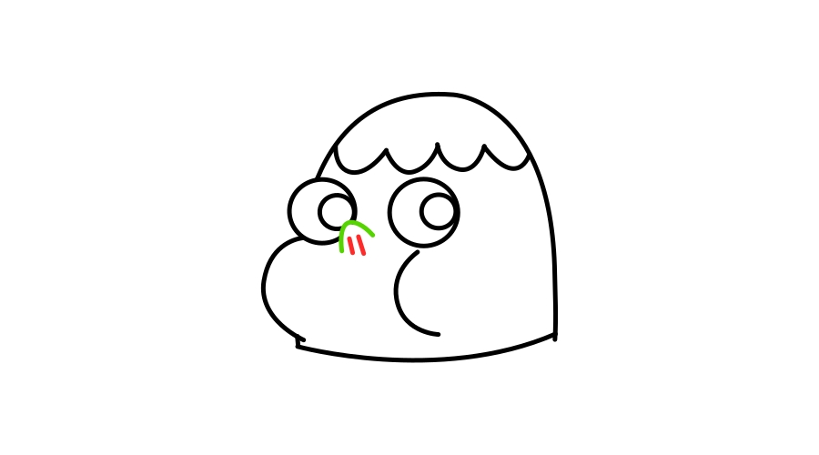
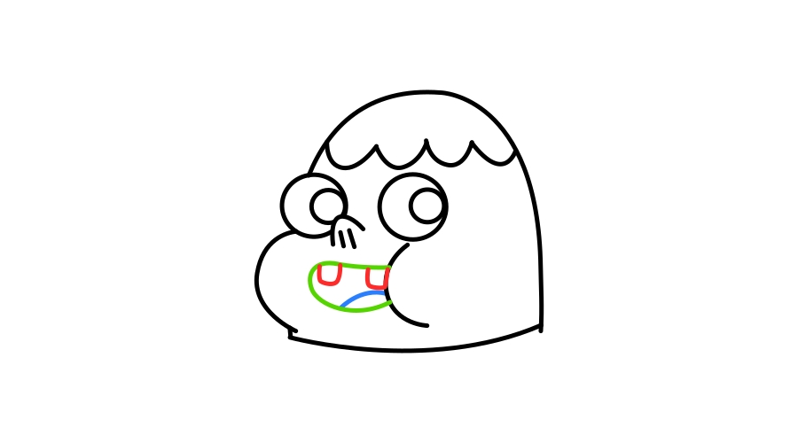
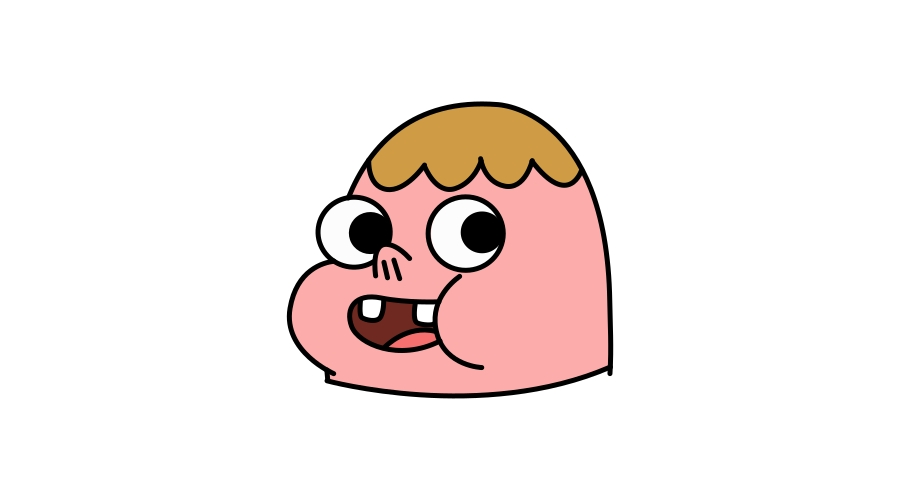

+++
title = "Como desenhar o Clarêncio"
description = "Tutorial passo a passo de como desenhar o personagem Clarêncio da série de desenhos animados."
categories = ["desenho"]
featuredImage = "/images/posts/capas/capa-tutorial-como-desenhar-clarencio.png"
download = "/downloads/material-como-desenhar-o-clarencio.zip"   # link para baixar material
+++

Pra você que é fã série e quer aprender a desenhar o **Clarêncio**, separei um passo a passo de como desenhar esse personagem usando apenas 4 letras: **U**, **C**, **O** e **I**. É um ótima atividade pra você tentar fazer com o seu filho pra ajudar no desenvolvimento artístico e cognitivo dele.

Ainda nesse post você pode baixar um guia completo e ilustrado de como desenhar o Clarêncio.

## Como desenhar a cabeça do Clarêncio

### Passo 1

O Clarêncio é feito de várias formas simples. A forma geral da cabeça dele tem formato de um **U invertido**. Pra completar temos também um **U mais aberto** na parte de baixo da cabeça pra fechar a forma geral da cabeça.

### Passo 2

Usando um **C** maior e outro menor conseguimos desenhar as bochechas do personagem. Note que elas são desenhadas quase no final da forma geral da cabeça que acabamos de desenhar. Isso vai ajudar no posicionamento dos outros elementos do rosto.

### Passo 3

Agora, conectando quatro letras **U** — uma do lado da outra, então conseguimos completar o desenho do cabelo do Clarêncio. Você pode ver isso também como ondas do mar, é uma forma mais simples de pensar.

### Passo 4

Bem próximo do cabelo vamos ter o desenho dos olhos do Clarêncio — que são bem grandes e redondos, bem parecidos com a forma da letra **O**.
Então você pode aproveitar pra fazer mais um par desses — só que agora um pouco menor, pra desenhar a [parte mais escura do olho](# "Pupila").

### Passo 5

Agora que os olhos estão desenhados no lugar certo temos a referência de onde o nariz vai ser desenhado. Basta desenhar a letra **U** invertida mais inclinada, e em seguida desenhar duas letras **I** na parte de dentro pra fazer as narinas.

### Passo 6

Pra concluir só falta a boca que quando está sorrido é um comprido **C** preenchido com duas letras **U** para os dentes, e um **U** invertido para a língua.

### Desenho completo

## Assista o passo a passo em vídeo


