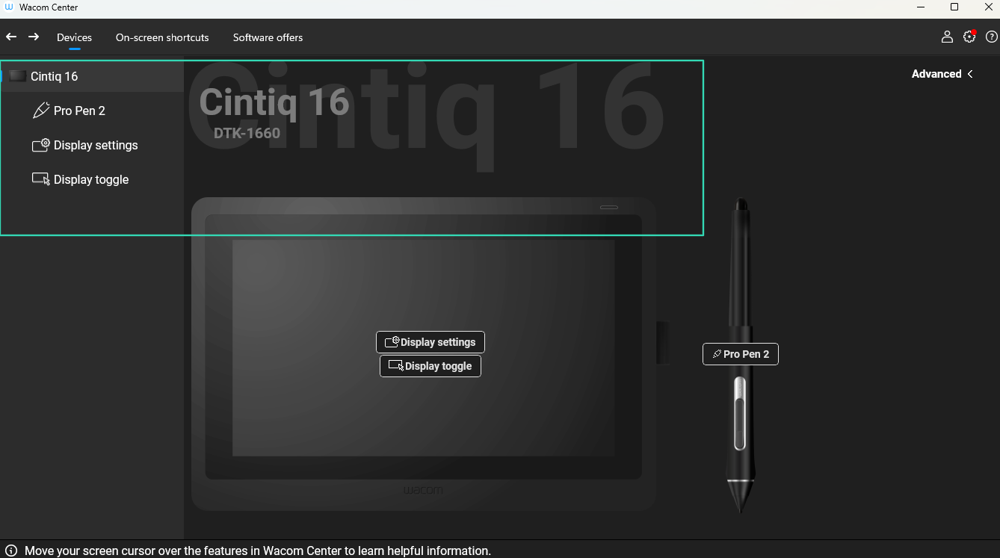
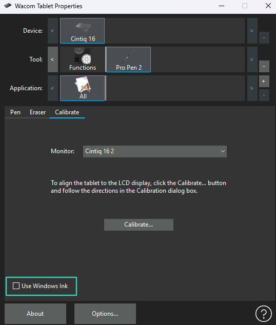
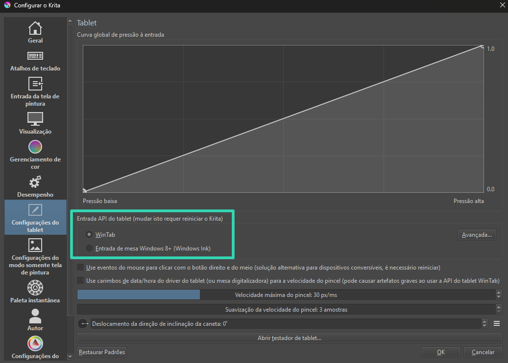
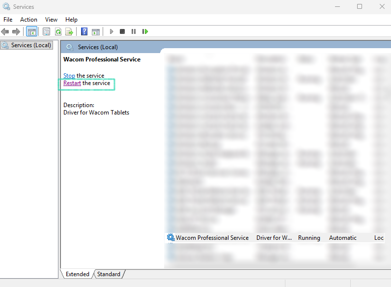
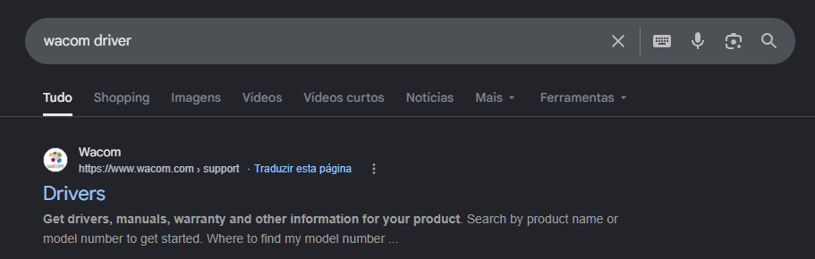
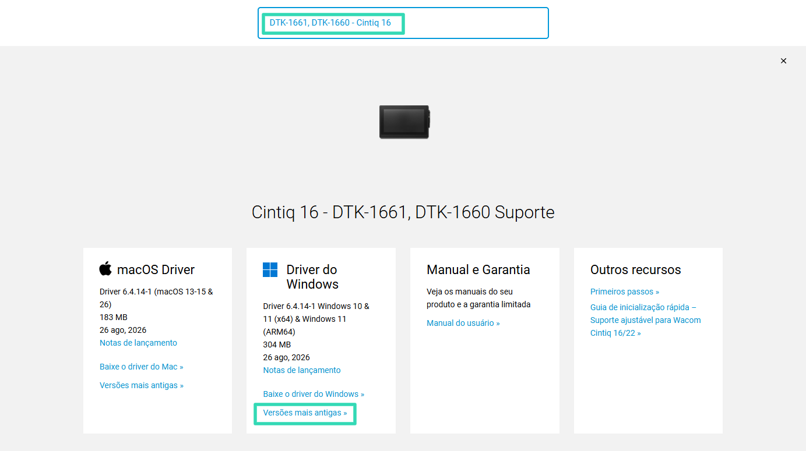
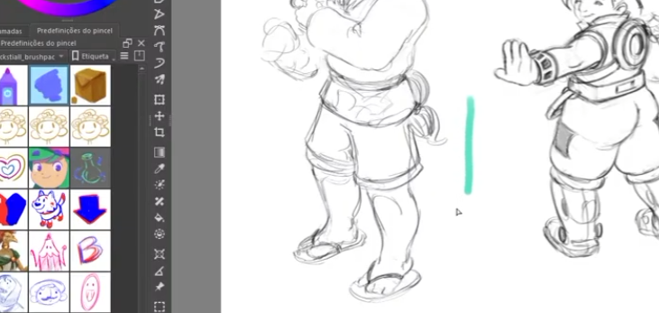
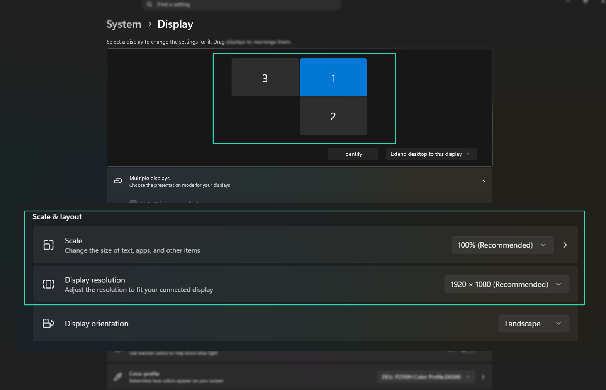
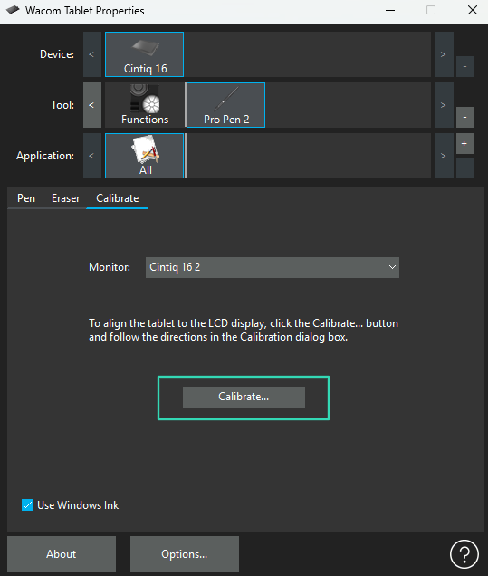

+++
title = "Mesa Digitalizadora Não Funciona? Soluções que Resolvem a Maioria dos Problemas"
description = "Veja 8 soluções para problemas com driver, caneta, pressão, Windows Ink, USB, serviços do Windows e cursor desenhando em um lugar diferente na mesa digitalizadora."
categories = ["equipamentos"]
+++

Se a sua **mesa digitalizadora não funciona** ou começou a dar algum problema no Windows, talvez este post consiga te ajudar.

Ao longo do tempo usando mesa digitalizadora, já passei por vários problemas diferentes. Às vezes a caneta simplesmente não responde, em outras a pressão para de funcionar. Também já aconteceu do cursor travar, de aparecer aquele círculo do Windows quando eu clicava com a caneta e até de eu encostar a caneta em um lugar e o cursor aparecer completamente em outro.

E o pior é que, dependendo do problema, você pode ficar sem saber se a mesa está com defeito, se é o driver ou se alguma configuração do Windows mudou.

Por isso, resolvi reunir aqui algumas das soluções que já usei para tentar fazer a mesa voltar a funcionar normalmente. Algumas são bem simples, como trocar a porta USB ou reiniciar o serviço do driver, enquanto outras envolvem testar outra versão do driver ou mexer nas configurações do Windows Ink.

Não significa que todas essas soluções vão funcionar para qualquer problema, mas são coisas que vale a pena testar antes de pensar que sua mesa digitalizadora estragou.

## 1. Veja se o computador está reconhecendo a mesa

Antes de começar a mexer em um monte de configurações, eu verificaria se o computador realmente tá reconhecendo a mesa.

Se o software do fabricante reconhecer a mesa normalmente, já sabemos que existe comunicação entre o computador e o dispositivo. Agora, se você conecta a mesa e o programa simplesmente não reconhece nada, eu começaria a investigar outras coisas.

Pode ser o driver.

Pode ser a porta USB.

Pode ser o cabo.

E, em alguns casos, pode ser algum problema no próprio dispositivo.

Essa verificação já ajuda bastante porque evita ficar tentando configurar a caneta quando o problema está, na verdade, na conexão da mesa com o computador.

## 2. Troque a porta USB

Essa é provavelmente uma das soluções mais simples da lista, mas vale muito a pena testar.

Se a mesa não está funcionando, desconecte o USB e coloque em outra porta do computador. Na época que eu usava a minha primeira mesa digitalizadora era o que eu mais fazia.

Se você tiver utilizando um hub USB, adaptador ou algum tipo de extensão, também vale fazer um teste conectando a mesa diretamente no computador.

Se você mudar a porta e a mesa voltar a funcionar normalmente, provavelmente o problema não estava no driver ou na configuração da caneta.

Estava na conexão que também é algo muito comum de acontecer.

## 3. Verifique o cabo

Se o cabo da sua mesa for removível, vale dar uma olhada nele também. Com o tempo de uso o cabo pode ficar com mau contato e causar problemas estranhos.

A mesa pode funcionar durante alguns minutos e depois parar.

Pode ficar desconectando e conectando sozinha, que era o caso da minha antiga mesa digitalizadora porque o conector já estava frouxo.

Pode funcionar dependendo da posição do cabo.

Ou simplesmente pode não ser reconhecida pelo computador.

Se você tiver outro cabo compatível, faça um teste.

Também vale observar se o conector está frouxo ou se o cabo apresenta algum sinal de desgaste, principalmente pra quem tem gatos em casa, não é difícil encontrar um cabo todo mordido.

## 4. Teste desativar o Windows Ink

Esse é um problema que incomoda bastante mas que é fácil de resolver.

Você encosta a caneta na mesa e aparece aquele **círculo do Windows na tela.**

<video src="windows-ink-wacom.mp4" controls width="100%"></video>

Dependendo do programa e da configuração da sua mesa, o Windows Ink pode acabar interferindo na maneira como a caneta funciona.

O Windows Ink existe justamente para melhorar a utilização de canetas no Windows, mas nem sempre ele trabalha da maneira que você espera com todos os programas e drivers.

Por isso, uma coisa que vale a pena testar é desativar o Windows Ink.

Pra fazer isso abrimos o programa que usamos pra configurar a mesa digitalizadora — no meu caso **Wacom Tablet Properties** ou Propriedades do Tablet Wacom, — e procure pela opção **Use Windows Ink**.

Dependendo da versão essa opção pode mudar de lugar, então procura em todas as abas que ela vai tá em algum lugar dessa janela de propriedades.

Se a opção **Windows Ink** estiver ativada, desative e faça um teste. Veja se aquele círculo desapareceu e se a caneta passou a responder melhor.

Se melhorou e resolveu o problema, ótimo.

Se alguma outra função parou de funcionar, ative novamente.

Se não quiser desativar o Windows Ink pra tudo, pelo menos aqui na Wacom você consegue fazer configurações diferentes pra cada aplicativo.

## 5. Teste a mesa em outro programa

Se a sua mesa não está funcionando em um programa mas estiver funcionando em outro, o problema provavelmente não está na mesa. O que já é um bom sinal.

Pode ser alguma configuração específica do software que você tá usando e que precisa modificar ou uma incompatibilidade entre o programa e o driver.

Se tiver outro computador pra testar, melhor ainda, porque se ela apresentar o mesmo problema, aí começa a fazer mais sentido investigar a própria mesa, caneta ou o cabo.

No caso do Krita, você pode ir no menu **Configurações** → **Configurar o Krita** → e ir até a aba **Configurações do tablet**.

Nessa tela você vai encontrar a opção **“Entrada API do tablet”**.

Existem duas opções principais: **WinTab** e **Entrada de mesa Windows 8+ (Windows Ink).**

Essa configuração é importante porque o Krita pode receber os dados da sua mesa digitalizadora de maneiras diferentes.

Geralmente vamos usar Windows Ink se aquela opção do Windows Ink tiver ativada nas configurações das propriedades da sua mesa digitalizadora. Se você desativar o Windows Ink, o ideal é selecionar a outra opção.

Se ainda assim não funciona, tenta usar a outra opção, não custa nada testar.

Depois disso é necessário reiniciar o Krita pra que a alteração realmente tenha efeito. Depois só fazer o teste novamente.

## 6. Reinicie o driver pelos Serviços do Windows

Uma das primeiras coisas que eu faço quando a mesa começa a apresentar algum problema é **reiniciar o serviço do driver**.

Pra fazer isso vamos usar a tecla <kbd>⊞ Windows</kbd> e buscar por **Services**, ou **Serviços**, se o Windows tiver em português. Também podemos usar o atalho <kbd>⊞ Windows</kbd> + <kbd>R</kbd> e digitar <code class="clickable-code" onclick="navigator.clipboard.writeText('services.msc'); const el = this; el.innerText = 'Copiado!'; setTimeout(() => { el.innerText = 'services.msc'; }, 1500);" title="Clique para copiar" style="cursor: pointer; background: rgba(128, 128, 128, 0.15); border: 1px solid rgba(128, 128, 128, 0.25); padding: 2px 5px; border-radius: 3px; font-family: monospace;">services.msc</code> pra abrir essa mesma janela de serviços.

Nessa janela você vai encontrar uma lista enorme de serviços. Vamos procurar o serviço relacionado ao driver da sua mesa.

O nome muda de acordo com o fabricante e com o driver instalado, então não adianta procurar necessariamente pelo mesmo nome que aparece aqui no meu computador se você usa uma marca de mesa digitalizadora diferente da minha.

Quando encontrar o serviço com o nome da sua mesa digitalizadora, clica nele e escolha a opção **Restart**, que é o **Reiniciar**. Espera um pouco até o Windows conseguir reiniciar o driver, fecha o programa de desenho, abre novamente e testa a caneta.

Sempre que minha caneta para de funcionar a pressão isso aqui já resolve pra mim.

Só tome cuidado para não sair reiniciando ou desativando serviços aleatórios do Windows. Se você não sabe qual serviço pertence à sua mesa, não mexa nele. Dá uma pesquisada no Google antes que outras pessoas podem informar direitinho o nome de outros drivers.

## 7. Teste outra versão do driver

Uma coisa que eu aprendi usando essas mesas digitalizadoras é que **nem sempre o driver mais novo é o melhor para você**.

Às vezes a mesa estava funcionando normalmente e, depois de uma atualização, alguma coisa começa a dar problema.

A pressão para de funcionar, a caneta fica estranha, o programa não reconhece direito a mesa ou alguma função simplesmente deixa de funcionar.

Quando isso acontece, vale testar uma versão anterior do driver até encontrar a ideal. Em alguns casos, inclusive, uma versão mais antiga acaba funcionando melhor do que a versão mais recente.

Busque no Google pela marca da mesa e coloca Driver em seguida, já deve aparecer um link pro site oficial. Digitamos o modelo exato da nossa mesa digitalizadora e vamos ver se existem outras versões do driver disponíveis.

Se você acabou de atualizar o driver e o problema começou depois disso, eu começaria justamente testando a versão anterior.

Antes de instalar remova o driver atual. Depois instale a outra versão, reinicie o computador e faça o teste de novo. É uma solução simples, mas pode resolver aqueles problemas que parecem não ter explicação.

## 8. O cursor fica em um lugar e o desenho sai em outro

Esse problema acontece comigo de vez em quando e eu sempre esqueço o que foi que eu fiz pra solucionar o problema. Geralmente é reiniciar o driver que resolve quase tudo, mas da última vez o problema foi outro.

Basicamente, você coloca a ponta da caneta em um lugar e o cursor aparece em outro. Ou então você começa a desenhar em uma determinada posição, mas o traço aparece deslocado na tela.

Como eu uso três monitores é normal isso acontecer. Então algumas soluções:

### Tente desinstalar e reinstalar o driver da mesa digitalizadora

Como falei anteriormente, se você atualizou o driver recentemente e isso começou a acontecer, volte pra versão anterior.

### Verificar o mapeamento da mesa digitalizadora

Se a mesa estiver configurada para um monitor diferente daquele em que você está desenhando, o cursor pode acabar aparecendo em uma posição diferente do esperado.

### Confira a área da mesa

Outra coisa que vale verificar é a área ativa da mesa.

Alguns drivers permitem definir exatamente em qual parte da mesa corresponde à tela.

Se essa área estiver configurada de maneira diferente do padrão, o movimento da caneta pode não corresponder ao movimento do cursor como você espera.

Se você não lembra de ter alterado essa configuração, tente restaurar o mapeamento para o padrão.

Depois configure novamente o monitor que você usa para desenhar.

### Verifique a configuração dos monitores no Windows

Também vale dar uma olhada nas configurações de tela do Windows.

Clique com o botão direito na área de trabalho e entre em: **Display Settings**/**Configurações de exibição.**

Veja se os monitores estão configurados corretamente e confira a resolução e escala.

Se você acabou de trocar de monitor, alterou a resolução ou mudou a configuração das telas, vale conferir novamente o mapeamento da mesa porque pode desconfigurar com essas mudanças, aqui acontece direto.

### Se for uma mesa com tela, verifique a calibração

Se a sua mesa possui uma tela própria como a minha Cintiq 16, existe outra possibilidade: a **calibração da caneta**.

Nesse caso, você pode tocar em um ponto da tela e o cursor aparecer alguns milímetros ou centímetros distante.

Procure no software da mesa por uma opção de **Calibração** ou **Calibration**.

Normalmente o programa mostra alguns pontos na tela e pede para você tocar neles com a caneta.

Faça a calibração seguindo os pontos indicados.

Depois teste novamente.

## Como saber por onde começar?

Se você está com a mesa digitalizadora parada agora e não sabe qual dessas soluções testar primeiro, eu seguiria uma ordem bem simples.

Primeiro, verificaria se o computador está reconhecendo a mesa.

Depois testaria outra porta USB e, se possível, outro cabo.

Se a mesa estiver sendo reconhecida, mas alguma função estiver estranha, aí eu partiria para reiniciar o driver.

Se o problema começou depois de uma atualização, testaria uma versão diferente do driver, que foi o que aconteceu comigo recentemente no dia de live.

Se a caneta estiver apresentando problemas de interação, testaria o Windows Ink.

E se o problema for especificamente o cursor aparecendo em um lugar diferente de onde você está tocando, verificaria primeiro o **mapeamento da mesa, o monitor selecionado, a calibração e também testar uma versão diferente do driver se você atualizou qualquer coisa recentemente.**

O mais importante é não sair alterando tudo de uma vez.

Faça um teste, veja o resultado e só depois passe para o próximo.

Assim fica muito mais fácil descobrir se o problema está no **driver, no Windows, no programa que você está usando, na conexão ou na própria mesa digitalizadora**.
