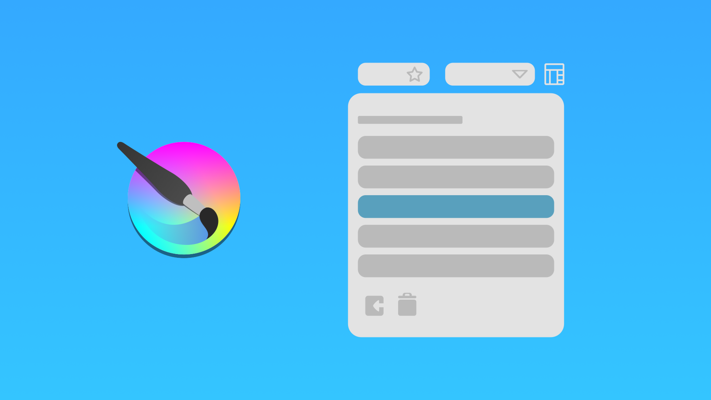
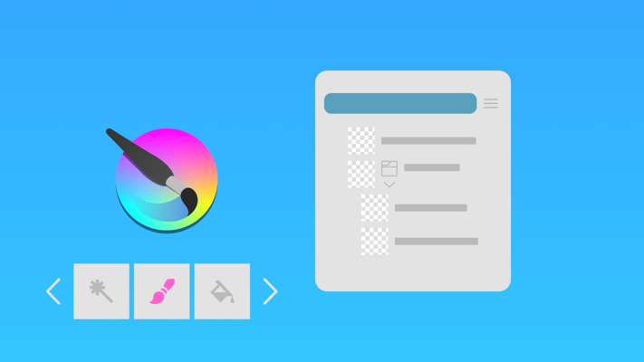
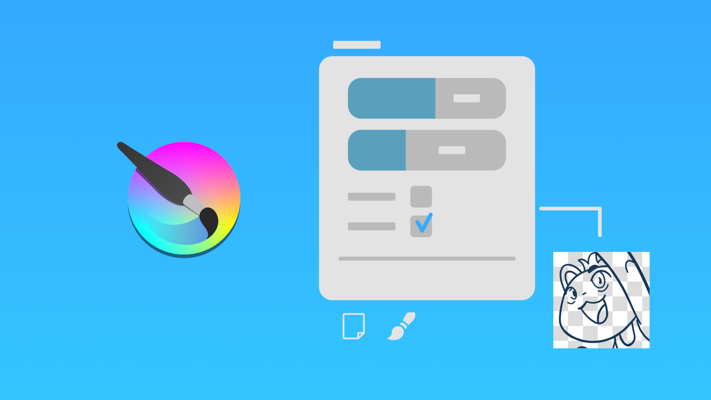
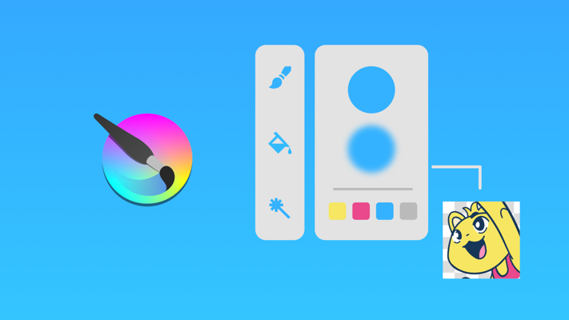
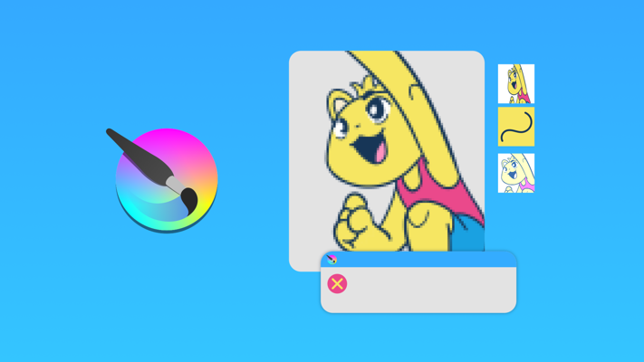
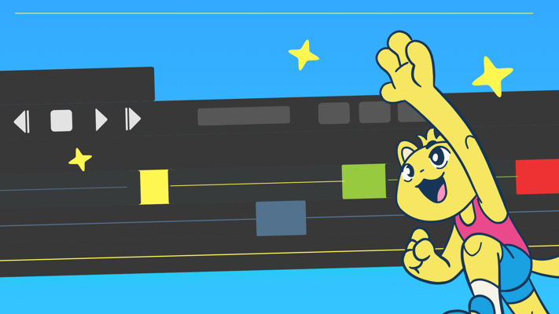

<h1>Comece a usar o Krita sem travar</h1>

Criado pra você que nunca usou o Krita e precisa entender o essencial para começar.

Você não precisa aprender tudo de uma vez — só o que realmente importa para desenhar e colorir com segurança.

<!-- SEÇÃO 1: O QUE VAI APRENDER -->

school
<h2>O que você vai aprender</h2>

<video autoplay muted loop playsinline>
<source src="krita-tools.mp4" type="video/mp4">
</video>

<strong>Ferramentas e painéis essenciais</strong>

Entenda o que realmente importa no Krita

<video autoplay muted loop playsinline>
<source src="krita-workspace.mp4" type="video/mp4">
</video>

<strong>Organização do espaço de trabalho</strong>

Deixe a interface do seu jeito

<video autoplay muted loop playsinline>
<source src="krita-drawing.mp4" type="video/mp4">
</video>

<strong>Fluxo de desenho e colorização</strong>

Dicas e ferramentas de desenho e pintura

<video autoplay muted loop playsinline>
<source src="krita-tips.mp4" type="video/mp4">
</video>

<strong>Ferramentas e truques extra</strong>

Conheça mais ferramentas e filtros do próprio Krita

<!-- SEÇÃO 2: PARA QUEM É -->

group
<h2>Para quem é esse curso</h2>

check_circle
Nunca usou o Krita

check_circle
Tentou e travou no começo

check_circle
Quer aprender um programa de desenho digital do zero

<!-- SEÇÃO 3: O QUE RECEBE (AGORA STACK VERTICAL ESTREITO) -->

card_giftcard
<h2>O que você recebe</h2>

keyboard
<strong>Atalhos personalizados</strong>

Todos os meus atalhos prontos para baixar e instalar no seu Krita.

play_circle
<strong>Acesso imediato</strong>

Comece a estudar agora mesmo! Todas as aulas já estão gravadas e organizadas na plataforma da Hotmart, permitindo que você assista no seu ritmo, de onde quiser.

forum

<strong>Grupo exclusivo no Discord</strong>
<button class="info-btn-discord">?</button>

Receba novidades, atualizações e suporte sobre o curso no nosso servidor exclusivo.

subtitles
<strong>Curso legendado</strong>

Todas as aulas do curso contam com legendas completas em português para garantir clareza no aprendizado de cada ferramenta.

<!-- SEÇÃO 4: CONTEÚDO DO CURSO (6 MÓDULOS COM IMAGEM) -->

format_list_numbered
<h2>Conteúdo do curso</h2>

O Krita para Iniciantes tem <b>6 módulos principais:</b>

<strong>01</strong> Introdução ao Krita

<strong>02</strong> Conceitos básicos

<strong>03</strong> Fazendo um desenho

<strong>04</strong> Colorindo o desenho

<strong>05</strong> Dicas e Truques

<strong>06</strong> Solução de problemas

Esses 6 módulos fazem parte da base do curso.

<!-- SEÇÃO 5: MÓDULOS EXTRA -->

auto_awesome
<h2>Módulos extra</h2>

Além desses módulos também teremos <b>módulos extra</b> pra cobrir outras ferramentas e painéis interessantes:

Disponível

<h3>Animação no Krita</h3>

Nesse módulo eu mostro as principais ferramentas de animação do Krita. Com essas aulas você vai ter o que precisa pra conseguir criar suas primeiras animações 2D.

EM PRODUÇÃO

<h3>Ferramentas de Quadrinhos</h3>

Um módulo dedicado só pra falar das ferramentas que ajudam na criação de quadrinhos. Vamos conhecer outros painéis que eu ainda não tinha mostrando em módulos anteriores.

<!-- SEÇÃO 6: FAQ (ACCORDION INTERATIVO) -->

quiz
<h2>Dúvidas comuns</h2>

Preciso saber desenhar?
expand_more

Não. O foco do curso é ensinar o uso técnico do Krita e de suas ferramentas, passo a passo, mesmo para quem está começando do zero absoluto.

Funciona para iniciantes?
expand_more

Sim! O curso foi planejado exatamente para quem nunca abriu o programa e quer aprender a desenhar e pintar digitalmente sem complicações.

Por quanto tempo tenho acesso?
expand_more

Você terá 2 anos de acesso completo a todas as aulas gravadas e atualizações do curso para assistir no seu próprio ritmo.

<!-- CTA FINAL -->

<h2>Comece agora</h2>

Tenha acesso imediato ao curso completo

<a href="https://hotmart.com/pt-br/marketplace/produtos/krita-para-iniciantes/I98301009X" class="btn-primary btn-main">Comprar</a>

